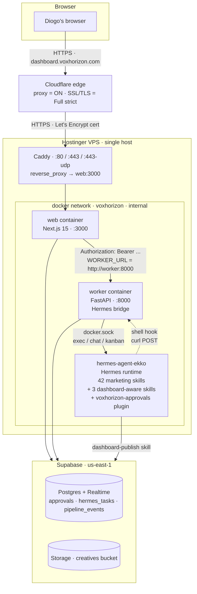

# Architecture

Locked spec for the VoxHorizon Marketing Control Panel. Living document — updated as milestones land. Source of record for design intent; if the code and this doc disagree, fix one or the other.

> Companion docs: [`README.md`](./README.md), [`SETUP.md`](./SETUP.md), [`SECRETS.md`](./SECRETS.md), [`db/SCHEMA.md`](./db/SCHEMA.md), [Master Tracker (issue #72)](../../issues/72).

---

## 1. Goal and scope

### Goal

Replace VoxHorizon's existing Slack-driven AI marketing department with a single-operator control panel. The Slack flows (approval threads, channel notifications, ad-hoc Ekko mentions) are out. The new UI carries everything: brief intake, creative review, launch packaging, audit, and approval governance.

The system has one operator (Diogo) and one upstream agent persona (Ekko). Ekko is the `hermes-agent-ekko` container — a Hostinger HVPS Hermes Agent running the Nous Research runtime, with 42 production marketing skills shipped by Hermes plus 3 dashboard-aware skills + 1 plugin we add. The dashboard's `web` container hosts the UI + Supabase persistence; a thin `worker` container bridges the dashboard to Hermes/Ekko.

### v1 scope

Two pipelines, both end to end:

- **Image-ad pipeline** — brief → prompt pack → generate image → review (with chat-with-Ekko iteration) → approve → mirror to Drive → assemble launch package → operator pushes to Meta manually.
- **Video pipeline** — brief → script → voiceover → b-roll search/assemble → compose → caption → review → approve → mirror to Drive → operator pushes manually.

Daily audit pulls Meta + GHL, computes Kill / Watch / Keep verdicts, surfaces them in the audit view. Notifications via web push + email. Every tool call Ekko wants to make passes through a `pre_tool_call` plugin that consults a policy → dashboard → operator decision pipeline before the tool runs.

### Explicit non-goals for v1

- Multi-operator. Single user. No app-level auth (network boundary + worker bearer is the gate).
- Public worker surface. The worker container is internal-only on the Docker network — only the dashboard is publicly addressable.
- Automated ad delivery to Meta. Operator pushes ads manually after approval — explicit human-in-the-loop gate. Removing this gate is post-v1.
- Multi-tenant. Tables have a `client_id` for analytical hygiene, but the UI is built around one operator's view of all clients.
- Cross-client portfolio analytics beyond per-client perf rollups.
- ClickUp integration (the operator owns task management outside the panel).
- Slack reintegration. Out of scope, full stop.
- RLS policies. v1 ships RLS off. Any multi-operator follow-up starts with an RLS migration.
- Claude Code as the agent runtime. **Dropped during the Hermes integration milestone (Waves 18–22, May 2026).** Hermes/Ekko is the engine.

---

## 2. System topology

v1 production is a **single-host stack** on one Hostinger VPS: the `hermes-agent-ekko` container (Hostinger's HVPS Hermes Agent image, runtime + 42 marketing skills) sits alongside our own Docker Compose stack (`caddy` + `web` + `worker`). All three of our containers and Ekko share the same Docker daemon and the same `/var/run/docker.sock`. The worker bridges into Ekko via that socket. The dashboard at `dashboard.voxhorizon.com` is the only public surface; the worker and `hermes-agent-ekko` are internal-only.

ASCII version (always rendered, no Mermaid required):

```
   Diogo's browser
        │
        │ HTTPS — TLS via Cloudflare edge cert
        ▼
   Cloudflare edge (proxy = ON, SSL/TLS = Full strict)
        │
        │ HTTPS — TLS via Let's Encrypt cert held by Caddy
        ▼
   ┌────────────────────────────────────────────────────────────────────────────┐
   │  Hostinger VPS — single host                                               │
   │                                                                            │
   │   Caddy (caddy:2-alpine, :80 / :443 / :443-udp)                            │
   │     · TLS on dashboard.voxhorizon.com                                      │
   │     · reverse_proxy → web:3000 (only public route)                         │
   │     · flush_interval -1 (preserves SSE chunking)                           │
   │                                                                            │
   │   docker network "voxhorizon" (internal)                                   │
   │   ┌──────────────────────────────┐   ┌──────────────────────────────────┐  │
   │   │  web (Next.js 15 :3000)      │   │  worker (FastAPI :8000)          │  │
   │   │  ghcr.io/.../voxhorizon-web  │   │  ghcr.io/.../voxhorizon-worker   │  │
   │   │  · App Router pages          │   │  · /work/hermes/chat (SSE)       │  │
   │   │  · API routes (/api/*)       │   │  · /work/hermes/kanban           │  │
   │   │  · Server Supabase client    │   │  · /work/hermes/webhook          │  │
   │   │  · Realtime browser client   │──▶│  · /work/hermes/approval (long-  │  │
   │   │  · lib/worker.ts → WORKER_URL│   │    poll)                         │  │
   │   │  · Approval UI               │   │  · Bearer-only ingress           │  │
   │   └──────────────┬───────────────┘   └─────┬──────────────────┬─────────┘  │
   │                  │                         │                  │            │
   │                  │ supabase-js (HTTPS)     │ docker.sock      │ /var/run/  │
   │                  │                         │ exec + shell     │ docker.    │
   │                  │                         │ hook target      │ sock       │
   │                  │                         ▼                  │            │
   │                  │   ┌──────────────────────────────────┐     │            │
   │                  │   │  hermes-agent-ekko               │◀────┘            │
   │                  │   │  ghcr.io/hostinger/hvps-hermes-  │                  │
   │                  │   │  agent:latest                    │                  │
   │                  │   │  · hermes chat -q (stdio)        │                  │
   │                  │   │  · hermes kanban (cli)           │                  │
   │                  │   │  · 42 marketing skills           │                  │
   │                  │   │  · 3 dashboard-aware skills:     │                  │
   │                  │   │      dashboard-publish           │                  │
   │                  │   │      dashboard-chat-publish      │                  │
   │                  │   │      dashboard-task-result       │                  │
   │                  │   │  · plugin: voxhorizon-approvals  │                  │
   │                  │   │      (in-process pre_tool_call)  │                  │
   │                  │   │  · post-tool-call / session-end  │                  │
   │                  │   │      hook → curl → worker        │                  │
   │                  │   └──────────────┬───────────────────┘                  │
   │                  │                  │                                      │
   └──────────────────┼──────────────────┼──────────────────────────────────────┘
                      │                  │ supabase-js (HTTPS, dashboard-publish skill)
                      ▼                  ▼
            ┌─────────────────────────────────────────────────────┐
            │  Supabase (us-east-1) · project jfzxlsaywztlytnobgej │
            │  · Postgres 15 + Realtime publication               │
            │  · Storage bucket: creatives                        │
            │  · approvals + approvals_policy_cache + hermes_tasks│
            │  · pipeline_events (with source enum)               │
            └─────────────────────────────────────────────────────┘
```

Key properties:

- **One public surface.** Only `dashboard.voxhorizon.com` is reachable from the internet. The worker, `hermes-agent-ekko`, and Caddy's HTTP port for the worker have no public hostnames.
- **Co-located by design.** Worker and Ekko run on the same Docker daemon. The worker mounts `/var/run/docker.sock` so it can `docker exec` into Ekko for low-latency chat and kanban. See [§7](#7-auth-model) and [`SECRETS.md`](./SECRETS.md#docker-socket-trade-off) for the security trade-off.
- **Two GHCR images, one Hostinger image, one VPS.** `voxhorizon-web`, `voxhorizon-worker`, and `ghcr.io/hostinger/hvps-hermes-agent` (Ekko) are pulled independently. Our compose stack rolls our two; Ekko is rolled by Hostinger.
- **One env file for both of our containers.** `/opt/voxhorizon/.env` is mounted via `env_file:` on `web` and `worker`. Ekko has its own env at `/opt/data/.env`. See [`SECRETS.md`](./SECRETS.md#vps-production-secrets) for the union inventory.

### Mermaid version (richer renderers)



---

## 3. Communication patterns

Four patterns lock in the post-Hermes topology. Each is the right tool for a different bandwidth / latency / persistence profile.

### Pattern 1 — Docker socket exec for streaming chat

Path: browser → web → worker → `docker.sock` → `hermes-agent-ekko`.

The worker shells into Ekko with `docker exec hermes-agent-ekko hermes chat -q "<prompt>" --pass-session-id <id>` and streams stdout back as SSE. Implementation lives in `worker/src/services/hermes_bridge.py` and `worker/src/routes/hermes_chat.py`. Bridge overhead measured at **5–15ms** per turn before the LLM responds (~30–90s tail for the actual answer).

Used for:

- Operator chat with Ekko on a creative side panel.
- Pipeline-stage proposals (Ekko drafts a config or picks the variants to ship).

### Pattern 2 — Hermes kanban for long async operations

Path: browser → web → worker → `docker.sock` → `hermes kanban create --assignee ekko --context <json>`.

The worker creates a kanban task; Hermes' gateway dispatches it to Ekko within ~60s. Ekko runs the skill chain, then writes results to Supabase via the `dashboard-publish` / `dashboard-task-result` skills. The dashboard reads them off `hermes_tasks` and `pipeline_events` via Realtime. Implementation in `worker/src/services/hermes_kanban.py` and `worker/src/routes/hermes_kanban.py`.

Used for:

- Advancing a pipeline from configuration → ideation, ideation → review, review → generation, etc. — each long-running stage is a kanban task.
- Retrying a single stage on failure.
- Cancellation (marks the task `cancelled`; the agent loop polls between substages and exits gracefully).

### Pattern 3 — In-process `pre_tool_call` plugin for approvals

Path: Ekko's tool call → `voxhorizon_approvals` plugin (in-process Python inside the Hermes container) → policy check → optional worker long-poll → Supabase Realtime → operator decision → back through.

This is the hot path. The plugin lives at `ekko-plugins/voxhorizon_approvals/` in this repo and is copied to `/opt/data/home/.hermes/plugins/` on the VPS. It registers a `pre_tool_call` hook which Hermes calls **in the same Python process** before every tool execution.

- **Allowlisted tools** (`read_file`, `list_files`, `glob`, `grep`, etc.): the plugin returns `None` immediately. **<1ms** total.
- **Cached-approved tools** (operator already approved the exact tool+args this session): same in-process check against `approvals_policy_cache` (hot cache). **<1ms**.
- **Sensitive tools** (`kie_generate`, `elevenlabs_tts`, `submagic_caption`, `shell_command`, `write_file`, etc.): the plugin POSTs to the worker at `/work/hermes/approval`, then long-polls. The worker inserts the approval row, the dashboard wakes via Supabase Realtime, the operator decides, the worker returns the decision, the plugin returns `None` (approve) or `{"action": "block", "message": "Operator denied: …"}` (reject).

Fail-closed: if the worker is unreachable mid-flight, the plugin **blocks** the tool call and writes an audit-trail line. Cron-scheduled Ekko runs cannot spend money on Kie or ElevenLabs without operator sanction.

### Pattern 4 — Hermes shell hooks for non-blocking observability

Path: Ekko → shell hook (post_tool_call / session_end / custom) → `curl POST` to worker `/work/hermes/webhook` → Supabase Realtime push → dashboard updates.

Configured in Ekko's `/opt/data/config.yaml` (a patch lives at `infra/hermes/config.yaml.patch`). Used for events that don't suspend the agent loop — they just need to surface in the dashboard.

Used for:

- "Skill finished" / "tool completed" events that hydrate the pipeline timeline.
- Session-end summaries.
- Custom Ekko-initiated dashboard pings.

Authenticated with `DASHBOARD_WEBHOOK_TOKEN` (a different token from the approvals token — see [`SECRETS.md`](./SECRETS.md#hermes-integration-secrets)).

---

## 4. Approval flow (end-to-end)

The approval flow is the highest-stakes path in the system — it's the only thing between Ekko and unsanctioned spend on Kie.ai, ElevenLabs, Submagic, etc. The sequence:

```
Ekko's agent loop calls a tool (e.g. kie_generate)
        │
        ▼
┌────────────────────────────────────────────────────────────────┐
│  Hermes runs every registered pre_tool_call hook IN-PROCESS    │
│  (Python; no subprocess; <1ms floor)                           │
│                                                                │
│  voxhorizon-approvals plugin's hook:                           │
│   1. policy.evaluate(tool_name, args, ctx)                     │
│      → allowlisted? return None (allow). <1ms.                 │
│      → cached-approved (this session)? return None. <1ms.      │
│   2. Otherwise: POST /work/hermes/approval to worker, await.   │
└────────────────────────────────────────────────────────────────┘
        │ HTTP over Docker network (~1-5ms RTT)
        ▼
┌────────────────────────────────────────────────────────────────┐
│  Worker /work/hermes/approval:                                 │
│   1. INSERT into Supabase `approvals` (status='pending').      │
│   2. Long-poll: Supabase Realtime subscription (≤500ms wake)   │
│      with 250ms polling fallback.                              │
│   3. ALSO fan out a notification (see §6):                     │
│       - VAPID push to operator's browser (always)              │
│       - Slack chat.postMessage (if risk_class='external-write' │
│         OR context.estimated_cost > 50)                        │
│   4. Configurable timeout (default 600s). On timeout, return   │
│      {"action": "block", "message": "Operator did not respond"}│
└────────────────────────────────────────────────────────────────┘
        │ Supabase Realtime push (≤500ms after dashboard subscribes)
        ▼
┌────────────────────────────────────────────────────────────────┐
│  Dashboard receives approval-pending event:                    │
│   1. <ApprovalModal /> opens with tool details, args diff,     │
│      context (which brief, which session, which skill).        │
│   2. Operator clicks Approve / Reject / Approve+remember.      │
│      Keyboard: A / R / S.                                      │
│   3. POST /api/approvals/{id}/decision → updates Supabase.     │
│   4. If "remember": INSERT approvals_policy_cache row keyed on │
│      (ekko_session_id, tool_name, sha256(canonical(args))).    │
└────────────────────────────────────────────────────────────────┘
        │ Supabase Realtime push back to worker
        ▼
┌────────────────────────────────────────────────────────────────┐
│  Worker's long-poll wakes, returns to plugin:                  │
│   decision=approved → return None to Hermes (tool runs)        │
│   decision=rejected → return {"action": "block",               │
│                               "message": "Operator denied: "+  │
│                               notes}                            │
└────────────────────────────────────────────────────────────────┘
        │ in-process return — <1ms
        ▼
Hermes proceeds (or aborts) the tool call.
```

The dashboard surfaces this flow in three places: the modal that auto-opens on the active page, the queue sidebar (badge + dropdown of pending approvals), and the `/approvals` audit page (full history filterable by session/tool/decision).

---

## 5. Performance budget

Per-tool-call latency floor on the approval hot path:

| Path                                                 | Steady-state latency                                           |
| ---------------------------------------------------- | -------------------------------------------------------------- |
| Allowlisted tool (`read_file`, `glob`, `grep`, etc.) | **<1ms** (in-process allowlist check, no HTTP)                 |
| Cached-approved tool (operator already approved)     | **<1ms** (in-process cache check via `approvals_policy_cache`) |
| First-time approval-required tool                    | ~30ms worker round-trip + operator response (typically 3–30s)  |
| Operator timeout                                     | 600s default; tool call aborts with the timeout message        |
| Worker unreachable                                   | **block** (fail-closed) — local audit-file entry, no spend     |

Per-turn budget: a typical Ekko turn fires 5–30 tool calls. Allowlisted reads dominate, so the plugin's overhead is **<30ms per turn**. The shell-hook subprocess approach would have been 250–3000ms per call — **the plugin is ~50–100× faster on the hot path.**

Other budgets worth recording:

- Chat first-token: bridge overhead 5–15ms; LLM tail 30–90s. Dominated by the LLM.
- Kanban dispatch: ≤60s after `hermes kanban create` returns. The gateway polls on a 60s tick.
- Realtime push: ≤500ms from `INSERT` on `approvals` to the modal opening, assuming the operator already has the dashboard mounted.

---

## 6. Notifications fan-out

Every approval inserted via the worker triggers a fan-out:

- **Always**: VAPID web-push to every device in `push_subscriptions` (best-effort; failures are logged, never block the approval).
- **High-urgency only**: a Block Kit message to the `#mkt-dept-updates` Slack channel (workspace `voxhorizon-internal`, channel ID `C0B43582YJF`) via `chat.postMessage`. High-urgency is defined as `risk_class === "external-write"` OR `context.estimated_cost > 50`.

```
                           ┌──────────────────────────────────────┐
                           │ approvals INSERT (status='pending')  │
                           └──────────────────────────────────────┘
                                              │
                          ┌───────────────────┴───────────────────┐
                          ▼                                       ▼
            ┌─────────────────────────┐         ┌──────────────────────────────┐
            │ ALWAYS                  │         │ HIGH-URGENCY ONLY            │
            │ push_delivery.fanout_  │         │ external-write OR cost > $50 │
            │ push → pywebpush →     │         │                              │
            │ every push_subscription│         │ chat.postMessage →           │
            │                        │         │   #mkt-dept-updates          │
            │  expired (404/410) →   │         │   ↳ Block Kit (header +      │
            │  prune row             │         │     context + cost +         │
            └─────────────────────────┘         │     args + CTA)              │
                                                └──────────────────────────────┘
```

Implementation lives in `worker/src/services/approval_notifications.py`. The Slack call goes directly to `https://slack.com/api/chat.postMessage` using the `Ekko` bot token sourced at deploy time from `/docker/hermes-shared/config/secrets.json` (key `EKKO_SLACK_BOT_TOKEN`) and surfaced as `SLACK_BOT_TOKEN`. Sensitive keys in `tool_args` (`*_token`, `*_secret`, `password`, `api_key`) are redacted before serialization — Slack channels are logged + indexed so anything we post becomes permanent.

The Block Kit body is composed of:

1. `header` — `Approval needed: <tool>` with a leading icon (`⚠️` for `external-write`, `💰` for cost-driven).
2. `section` — context fields (pipeline, brief, creative, skill, session, risk) — only the keys actually present.
3. `section` — `Estimated cost: $X.XX`; above $100, decorated as `🚨 HIGH SPEND` for at-a-glance triage.
4. `section` — sanitized JSON args, truncated to ≤600 chars, wrapped in a triple-backtick code fence.
5. `actions` — single primary button "Open in dashboard" linking to `${DASHBOARD_BASE_URL}/approvals/{id}`.

The Slack call is fire-and-forget — any failure (`ok: false`, network error, malformed JSON) is logged as `slack_post_failed` / `slack_post_exception` and swallowed; the badge still updates via Supabase Realtime regardless. If `SLACK_BOT_TOKEN` or `SLACK_APPROVAL_CHANNEL_ID` is unset, the worker logs `slack_notification_skipped_missing_env` and continues — push still runs.

Push delivery uses VAPID keys (`VAPID_PUBLIC_KEY` for the browser subscribe, `VAPID_PRIVATE_KEY` for the server-side sign). Failed deliveries (HTTP 410 / 404) prune the dead subscription row from `push_subscriptions`.

### Dormant: Resend email path

Pre-2026-05-18, the high-urgency surface was a transactional email shipped through Resend, rendered server-side via a `react-email` template at `lib/emails/HighUrgencyApprovalEmail.tsx` and routed through `app/api/internal/approval-email/route.ts`. The route and template are preserved in the tree as dormant code so the pivot is reversible — reviving the email channel is a one-config-flag flip plus restoring `RESEND_API_KEY`, `OPERATOR_EMAIL`, and `INTERNAL_API_TOKEN` rather than re-implementing.

The dashboard's sidebar badge counts every pending approval in `approvals` via a server-side query, refreshed on Realtime push.

---

## 7. Data flow

Where each piece of state lives:

| State                           | Home                                                                                                                                       | Why                                                                                                                                  |
| ------------------------------- | ------------------------------------------------------------------------------------------------------------------------------------------ | ------------------------------------------------------------------------------------------------------------------------------------ |
| Briefs (image + video)          | Postgres                                                                                                                                   | Mutable, audited, queried by Kanban + funnel. Driver of everything downstream.                                                       |
| Creatives (image + video)       | Postgres metadata + Supabase Storage assets                                                                                                | Postgres tracks status and pipeline path; Storage holds the bytes; Ekko's skills write artifacts here via `dashboard-publish`.       |
| Iteration / conversation thread | Postgres (`creative_iterations`, `video_iterations`)                                                                                       | Append-only; powers the side-panel timeline and the chat replay.                                                                     |
| Copy variants                   | Postgres                                                                                                                                   | Small, structured, no asset bytes.                                                                                                   |
| Launch packages                 | Postgres                                                                                                                                   | Bundles refs to creatives + targeting/budget payload.                                                                                |
| Performance snapshots           | Postgres (`campaign_perf_image`, `campaign_perf_video` + `v_campaign_perf` view)                                                           | Daily writes from Ekko's `campaign-audit` skill, served straight to the audit view.                                                  |
| Drive mirrors                   | Google Drive                                                                                                                               | Operator-shareable assets. Ekko's skills mirror via the Hostinger-side `gog` credentials; the pipeline doesn't read back from Drive. |
| Hermes tasks                    | Postgres (`hermes_tasks`)                                                                                                                  | Mirror of the Hermes kanban work queue so the dashboard can render task state via Realtime without polling Hermes.                   |
| Pipeline events                 | Postgres (`pipeline_events` with `source` enum: `worker` / `hermes-hook` / `hermes-task` / `manual`)                                       | Append-only stage transitions; powers the stepper. The `source` column tracks which subsystem emitted the event.                     |
| Approvals                       | Postgres (`approvals` + `approvals_policy_cache`)                                                                                          | Every pre_tool_call decision the operator makes, plus a per-session cache so "approve and remember" survives across the session.     |
| Events                          | Postgres (`events`)                                                                                                                        | Append-only domain event log. **Not on Realtime** (too noisy).                                                                       |
| Cron / sync audit               | Postgres (`sync_log`)                                                                                                                      | Ekko's `campaign-audit` skill checks in here on each daily run. Not on Realtime.                                                     |
| Operator overrides              | Postgres (`overrides`)                                                                                                                     | Hand-edits any cell on any table at read time via left-join, without mutating pipeline-produced rows.                                |
| Push subscriptions              | Postgres (`push_subscriptions`)                                                                                                            | One row per operator device.                                                                                                         |
| Secrets                         | `.env.example` (git) + GH Actions repo secrets (build) + `/opt/voxhorizon/.env` on VPS (runtime, chmod 600) + `/opt/data/.env` (Ekko-side) | Never in Postgres, never in git. See [`SECRETS.md`](./SECRETS.md).                                                                   |

Reads in the UI come from Supabase directly (server components use the server client; client components use the browser client + Realtime subscriptions). Writes go through Next.js API routes that use the service-role client. The worker uses the service-role key for its approval / webhook persistence. Ekko's `dashboard-publish` skill uses the service-role key via env on the Hermes side.

---

## 8. Pipeline shapes

### Image pipeline

```
brief (status: draft → posted → approved)
  │
  ▼
prompt pack JSON  ──┐
                    │ Ekko skill: image-ad-prompting (kanban task)
brief context  ─────┘
  │
  ▼
Ekko's chained skills generate the image (kie_generate via Hermes' native Kie.ai integration)
  │
  ▼
creatives.file_path_supabase (private bucket "creatives", written by dashboard-publish skill)
  │
  ▼   creative_iterations append: kind=generate, author=ekko
side-panel review (variants grid + per-creative side panel)
  │
  ├─ operator edits → kind=user_edit
  ├─ chat with Ekko → SSE via Docker exec → kind=regenerate
  │
  ▼   status → approved
Ekko mirrors to Drive
  │
  ▼
launch_packages row (status: validating → ready)
  │
  ▼
operator pushes to Meta Ads manually (explicit gate)
```

### Video pipeline

```
video_brief (status: draft → posted → approved)
  │
  ▼
Ekko skill: campaign-brief + voiceover-broll chain → script outline
  │
  ▼   video_creatives row created with status=script_ready
Ekko's ad-creative skill: ElevenLabs voiceover → voiceover_path
  │
  ▼   status=voiceover_ready
Ekko's broll-sourcing skill: stock + brand library search
  │
  ▼   status=broll_ready
Ekko composes (Hyperframes-equivalent via Hermes) → composed_path
  │
  ▼   status=composed
Ekko captions (Submagic via Hermes integration) → captioned_path
  │
  ▼   status=captioned
side-panel review (similar to image side, with timeline scrubber)
  │
  ▼   status=approved
Drive mirror + launch_packages (video variant)
  │
  ▼
operator pushes manually
```

Parallel-vertical separation: image and video are **structurally parallel** in the database (`briefs` vs `video_briefs`, `creatives` vs `video_creatives`, `creative_iterations` vs `video_iterations`, etc.). Shared concerns (`clients`, `events`, `overrides`, `sync_log`, `push_subscriptions`, `approvals`, `hermes_tasks`, `pipeline_events`) live in one place. This keeps either side free to add format-specific columns without churning the other.

---

## 9. Agent model

Ekko is the marketing dept's persona. Post-Hermes-integration implementation:

- **Hermes/Ekko owns the agent loop.** `hermes-agent-ekko` runs the Nous Research runtime with provider-agnostic LLM routing, persistent FTS5 session memory, durable kanban work queue, and 42 production marketing skills (`campaign-brief`, `campaign-audit`, `ad-creative`, `image-ad-prompting`, `broll-sourcing`, `launch-gate`, …). All shipped by Hostinger.
- **We add 3 dashboard-aware skills.** `dashboard-publish` (generic Supabase upsert helper), `dashboard-chat-publish` (append assistant reply to `chat_messages`), and `dashboard-task-result` (write final artifacts + a `pipeline_events` row when a kanban task completes). Each ships with a small Python helper that hits Supabase via the service-role key from `/opt/data/.env`.
- **We add 1 plugin.** `voxhorizon-approvals` registers a `pre_tool_call` hook to route sensitive tool calls through the dashboard. See [§4](#4-approval-flow-end-to-end).
- **Two communication modes from the dashboard side.**
  - **Streaming chat (Docker exec → `hermes chat -q`)** for operator chat with Ekko in the side panel. Stdout is parsed and emitted as SSE.
  - **Kanban tasks (Docker exec → `hermes kanban create`)** for long-running work. Ekko's gateway dispatches within ~60s.
- **No subprocess from the worker.** The worker no longer spawns Claude Code or any agent binary itself. Every agent action is dispatched into the Hermes container.

---

## 10. Auth model

Layered. No single failure removes all defenses.

- **Network boundary: Caddy + Cloudflare.** Only `dashboard.voxhorizon.com` is publicly addressable. The worker container has no published port (`expose: ["8000"]` on the compose network only); the host firewall blocks inbound `:8000`. `hermes-agent-ekko` exposes `ttyd :4860` only on localhost (or behind a Hostinger-managed reverse proxy if the operator wants the admin TTY public).
- **Worker boundary: shared-secret bearer.** Every web→worker call carries `Authorization: Bearer <WORKER_SHARED_SECRET>`. The worker compares with `hmac.compare_digest` (constant-time). Calls travel over the Docker network (`http://worker:8000`) — never a public TLS hop.
- **Hermes → worker boundary: bearer tokens, distinct per surface.**
  - `DASHBOARD_WEBHOOK_TOKEN` — Ekko's shell hooks → worker webhook.
  - `VOXHORIZON_APPROVAL_TOKEN` — `voxhorizon-approvals` plugin → worker approval long-poll.
  - `INTERNAL_API_TOKEN` (dormant) — worker → Next.js internal email render endpoint. Currently unused after the 2026-05-18 Slack pivot; preserved so reviving the email channel is a config-only change.
    Keeping the tokens distinct means an Ekko compromise that leaks the webhook token can't pivot to the approval surface.
- **Worker → Slack boundary: bot token.** `SLACK_BOT_TOKEN` (the `Ekko` bot in workspace `voxhorizon-internal`) is sent only as a request header to `slack.com/api/chat.postMessage`; the worker never accepts inbound Slack traffic.
- **Worker → Hermes: Docker socket.** The worker mounts `/var/run/docker.sock`. This is **root-equivalent access on the host** — mitigations documented in [`SECRETS.md`](./SECRETS.md#docker-socket-trade-off): only the worker mounts it, the worker has strict bearer auth on every route, no untrusted code paths run in the worker, the worker and Ekko are co-located by design.
- **Optional middleware.** `middleware.ts` implements an IP gate hook. Default: off. Setting `TAILSCALE_ONLY=1` logs non-tailnet IPs; `TAILSCALE_ONLY=strict` returns 403. Repurposable when the operator wants a Tailscale-only access layer in front of the dashboard for staging.
- **No Supabase Auth.** No user accounts. No magic links. No JWT issuance. RLS is off. The service-role key is the only credential the app ever uses against Postgres.
- **No CSRF tokens.** Single-operator + same-origin POSTs (web container is the only origin) mean there's no cross-site attacker to defeat. If the boundary changes (multi-operator, public auth), CSRF and RLS are the entry points.

---

## 11. Deployment

v1 production runs as a single-host Docker Compose stack on one Hostinger VPS: `caddy` + `web` + `worker` plus the operator-managed `hermes-agent-ekko`. Two GHCR images for our stack (`voxhorizon-web`, `voxhorizon-worker`); the Hermes image is pulled by the operator at provisioning time. Caddy fronts the dashboard for public HTTPS; the worker is internal-only.

### Image pipeline

- **`build-web.yml`** builds the repo-root `Dockerfile` (Next.js standalone) and pushes `ghcr.io/pveloso01/voxhorizon-web:{latest,<sha>}`. Build-time secrets (`NEXT_PUBLIC_SUPABASE_URL`, `NEXT_PUBLIC_SUPABASE_ANON_KEY`, `NEXT_PUBLIC_VAPID_PUBLIC_KEY`) are injected as `--build-arg`s — Next.js inlines them at build time.
- **`build-worker.yml`** builds `worker/Dockerfile` and pushes `ghcr.io/pveloso01/voxhorizon-worker:{latest,<sha>}`. The worker reads every secret at runtime; no build-time secrets needed. The worker image includes the Python Docker SDK (`docker>=7.0`) so the `hermes_bridge.py` service can `exec_run` into Ekko.

### Compose stack

```yaml
services:
  caddy: # public TLS termination on dashboard.voxhorizon.com
  web: # Next.js, expose:3000
  worker: # FastAPI, expose:8000
    volumes:
      - /var/run/docker.sock:/var/run/docker.sock
    group_add:
      - "${DOCKER_GID}" # so the non-root app user can use the socket
    environment:
      HERMES_CONTAINER_NAME: hermes-agent-ekko
```

The `hermes-agent-ekko` container is **not** declared in our compose file — it's managed by the operator under `/docker/hermes-agent-t4k4/` on the VPS. Our worker simply addresses it by container name on the shared Docker daemon.

### Hermes-side install (post-deploy, one-shot)

After our compose stack is up, the operator applies the Hermes-side overlay (idempotent):

1. Apply `infra/hermes/config.yaml.patch` to `/docker/hermes-agent-t4k4/config.yaml` — adds the `post_tool_call` / `session_end` hooks and registers `voxhorizon-approvals` in `plugins.enabled`.
2. Copy `ekko-skills/{dashboard-publish,dashboard-chat-publish,dashboard-task-result}/` to `/opt/data/skills/` on the VPS.
3. Copy `ekko-plugins/voxhorizon_approvals/` to `/opt/data/home/.hermes/plugins/`.
4. Set `SUPABASE_URL`, `SUPABASE_SECRET_KEY`, `DASHBOARD_WEBHOOK_URL`, `DASHBOARD_WEBHOOK_TOKEN`, `VOXHORIZON_APPROVAL_WORKER_URL`, `VOXHORIZON_APPROVAL_TOKEN` in `/opt/data/.env`.
5. Restart `hermes-agent-ekko`.

Health-check the bridge:

- `curl http://worker:8000/work/health` (inside the compose network) → `{ok:true, hermes_container:"running"}`.
- `curl http://worker:8000/work/hermes/approval` → `200` with a valid bearer.
- `docker compose exec worker python -c "import docker; print(docker.from_env().containers.get('hermes-agent-ekko').status)"` → `running`.

See [`infra/deploy/README.md`](./infra/deploy/README.md) for the full deploy contract.

### Per-service rollback

Each container has its own image tag; rollback pins only the broken service:

```bash
WEB_IMAGE_TAG=<prev-web-sha>   docker compose up -d web
WORKER_IMAGE_TAG=<prev-worker-sha> docker compose up -d worker
```

The Hermes container is operator-rolled (Hostinger's image, pinned in `/docker/hermes-agent-t4k4/docker-compose.yml`).

---

## 12. Decision log

Locked decisions, dated. **Master Tracker [#72](../../issues/72) is the canonical source if anything below drifts.**

| Date           | Decision                                                                                                                                                                                 | Rationale                                                                                                                                                                                                                                                |
| -------------- | ---------------------------------------------------------------------------------------------------------------------------------------------------------------------------------------- | -------------------------------------------------------------------------------------------------------------------------------------------------------------------------------------------------------------------------------------------------------- |
| 2026-05-16     | Two-pipeline v1 (image + video), parallel-vertical schema.                                                                                                                               | Image alone was insufficient; video is core to VoxHorizon's output cadence. Parallel-vertical lets either side evolve independently.                                                                                                                     |
| 2026-05-16     | Single operator (Diogo). No app-level auth.                                                                                                                                              | Network boundary (Caddy + Cloudflare) + worker bearer is enough; building multi-user auth pre-product-market-fit is waste.                                                                                                                               |
| 2026-05-16     | Slack dropped from the marketing dept.                                                                                                                                                   | The Slack workflow was the bottleneck this build replaces. Keeping it would dilute the rebuild.                                                                                                                                                          |
| 2026-05-18     | Single-host VPS stack (web + worker as two containers fronted by Caddy on one Hostinger VPS).                                                                                            | Lower latency, single ops surface, smaller attack surface. Supersedes the Mac+Tailscale-Funnel and Vercel paths.                                                                                                                                         |
| 2026-05-16     | Supabase (Postgres + Realtime + Storage). Region us-east-1. Project `jfzxlsaywztlytnobgej`.                                                                                              | Real-time UI updates from Postgres are the killer feature; Storage colocates well.                                                                                                                                                                       |
| 2026-05-16     | Next.js 15 (App Router) + React 19 + Tailwind + shadcn/ui.                                                                                                                               | Familiar, server-side-rendering-friendly, matches the developer-tool aesthetic.                                                                                                                                                                          |
| 2026-05-16     | Hybrid Kanban + funnel header.                                                                                                                                                           | Pure Kanban hides funnel pressure; pure funnel hides individual brief state. Hybrid carries both.                                                                                                                                                        |
| 2026-05-16     | Per-creative side panel for review (image + prompt + thread + chat-with-Ekko + approve/reject).                                                                                          | Single locus for everything; cuts back-and-forth between tabs.                                                                                                                                                                                           |
| 2026-05-16     | Browser push + email notifications (Resend).                                                                                                                                             | Two channels for redundancy. Push for live presence, email for offline.                                                                                                                                                                                  |
| **2026-05-18** | **Slack `chat.postMessage` replaces Resend email for the high-urgency surface.** Resend route + react-email template kept in-tree as dormant code.                                       | The operator already lives in Slack daily; surfacing high-urgency approvals where attention is shortens response time. Pivot is reversible via a single config-flag flip, so the email infrastructure stays in place.                                    |
| 2026-05-16     | RLS off for v1.                                                                                                                                                                          | Single operator. Becomes the entry point for the multi-operator follow-up.                                                                                                                                                                               |
| 2026-05-16     | Conventional Commits + single-author workflow. No Co-Authored-By or AI attribution in commits/PRs.                                                                                       | Aesthetic preference; preserves a clean human-authored history for the operator.                                                                                                                                                                         |
| **2026-05-18** | **Hermes/Ekko replaces Claude Code as the agent engine.** Worker LOC reduced ~80%; the worker becomes a thin Hermes bridge (Docker socket exec + kanban + webhook + approval long-poll). | Probed the VPS: Hostinger's HVPS Hermes Agent already has 42 production marketing skills, durable kanban, FTS5 memory, provider-agnostic LLM routing. Reusing it skipped ~3,000 LOC of orchestration work and put the dashboard on a known-good runtime. |
| **2026-05-18** | **Dashboard-driven approvals via in-process `pre_tool_call` plugin.**                                                                                                                    | Plugin path is **50–100× faster** than a shell-hook subprocess on the hot path (allowlisted reads dominate). Fail-closed when the worker is unreachable.                                                                                                 |
| **2026-05-18** | **Distinct bearer tokens per Hermes→worker surface** (`DASHBOARD_WEBHOOK_TOKEN`, `VOXHORIZON_APPROVAL_TOKEN`, `INTERNAL_API_TOKEN`).                                                     | Containment: an Ekko compromise that leaks the webhook token can't pivot to the approval surface or the internal email render endpoint.                                                                                                                  |
| 2026-05-16     | `events` and `sync_log` excluded from Realtime publication.                                                                                                                              | Noise. The UI doesn't need to react to every domain event; targeted queries serve the surfaces that care.                                                                                                                                                |
| 2026-05-16     | `overrides` table as the operator-correction layer.                                                                                                                                      | Hand-edits without mutating pipeline rows; left-join at read time.                                                                                                                                                                                       |

---

## 13. What's intentionally NOT in v1

- Multi-tenant. `client_id` exists for analytical hygiene only.
- Public worker surface. The worker is internal-only on the Docker network.
- Public Hermes ttyd. The admin TTY stays on localhost (or behind Hostinger's reverse proxy if the operator wants it remote).
- Automated Meta posting. Manual approval gate, explicit, retained intentionally.
- Multi-host / multi-VPS deploy. v1 is one VPS, one stack.
- Vercel hosting.
- Slack reintegration of any kind.
- ClickUp integration. The operator manages tasks outside the panel.
- RLS policies. A future migration is the entry point.
- Multi-language UI. English only.
- Theme toggle. Light mode only.
- Mobile-first responsive. Desktop-first; mobile responsive sweep lands later.
- Web Application Firewall.
- Cross-client portfolio analytics beyond per-client perf rollups.
- Per-creative comments from non-operator parties.
- Email reply parsing.
- File version history (Drive holds canonical revisions externally).
- Granular per-feature permissions.
- Audit log retention policy. Append-only forever; if size becomes an issue, partition `events` / `approvals` later.
- Approval batching ("approve all 4 of these `kie_generate` calls at once"). v1 is one approval per tool call.
- LLM-driven risk classification. v1 uses a static policy file; a follow-up could use `ctx.llm.complete()` inside the plugin.
- Multi-agent kanban dispatch (Forge / Archer / Monarch in parallel — explore once Ekko-only proves stable).
