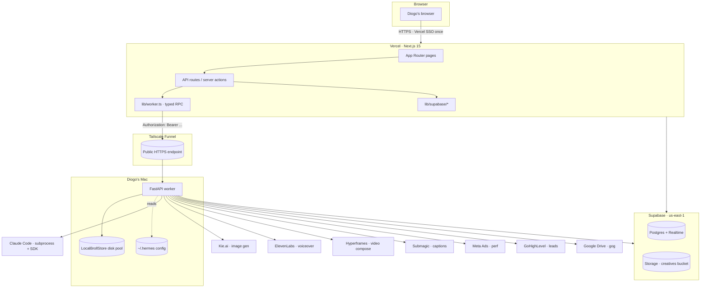

# Architecture

Locked spec for the VoxHorizon Marketing Control Panel. Living document — updated as milestones land. Source of record for design intent; if the code and this doc disagree, fix one or the other.

> Companion docs: [`README.md`](./README.md), [`SETUP.md`](./SETUP.md), [`SECRETS.md`](./SECRETS.md), [`db/SCHEMA.md`](./db/SCHEMA.md), [Master Tracker (issue #72)](../../issues/72).

---

## 1. Goal and scope

### Goal

Replace VoxHorizon's existing Slack-driven AI marketing department with a single-operator control panel. The Slack flows (approval threads, channel notifications, ad-hoc Ekko mentions) are out. The new UI carries everything: brief intake, creative review, launch packaging, and audit.

The system has one operator (Diogo) and one upstream agent persona (Ekko). Ekko is a Claude Code agent whose behavior is shaped by **two skills**, one per pipeline format:

- `image-ad-prompting` — drives the image-ad pipeline
- `video-voiceover-broll` — drives the video pipeline

Ekko is routed by `brief.type` (or the corresponding video table). The chat surface streams Ekko's tool-use back to the operator via SSE.

### v1 scope

Two pipelines, both end to end:

- **Image-ad pipeline** — brief → prompt pack → generate image → review (with chat-with-Ekko iteration) → approve → mirror to Drive → assemble launch package → operator pushes to Meta manually
- **Video pipeline** — brief → script → voiceover → b-roll search/assemble → compose → caption → review → approve → mirror to Drive → operator pushes manually

Daily audit pulls Meta + GHL, computes Kill / Watch / Keep verdicts, surfaces them in the audit view. Notifications via web push + email.

### Explicit non-goals for v1

- Multi-operator. Single user. No app-level auth (Tailscale + Vercel Deployment Protection is the gate).
- Public API surface. The worker is private to the tailnet + Vercel.
- Automated ad delivery to Meta. Operator pushes ads manually after approval — explicit human-in-the-loop gate. Removing this gate is post-v1.
- Multi-tenant. Tables have a `client_id` for analytical hygiene, but the UI is built around one operator's view of all clients.
- Cross-client portfolio analytics beyond per-client perf rollups.
- ClickUp integration (the operator owns task management outside the panel).
- VPN-less deploy. The worker stays local on the Mac. Cloud-deploying the worker is post-v1.
- Slack reintegration. Out of scope, full stop.
- RLS policies. v1 ships RLS off. Any multi-operator follow-up starts with an RLS migration.

---

## 2. System topology

ASCII version (always rendered, no Mermaid required):

```
   Diogo's browser
        │
        │ HTTPS (Vercel Deployment Protection challenge once per session)
        ▼
   ┌─────────────────────────────────────────────────────────────────┐
   │  Vercel — Next.js 15 (App Router, React 19, Tailwind, shadcn)   │
   │  · Pages: dashboard, briefs, creatives, launches, audit,        │
   │           clients, settings                                     │
   │  · API routes: /api/worker/*, /api/briefs/*, /api/creatives/*,  │
   │                /api/launches/*, /api/health                     │
   │  · Server-side Supabase admin client for writes                 │
   │  · Browser Supabase client for Realtime subscriptions           │
   │  · Typed worker RPC (lib/worker.ts) — Bearer auth + retries     │
   │  · Tailscale-only middleware (defense in depth, off by default) │
   └──────────┬──────────────────────────────────────────┬───────────┘
              │                                          │
              │ supabase-js                              │ HTTPS (Bearer)
              │                                          │
              ▼                                          ▼
   ┌────────────────────────────┐         ┌───────────────────────────────┐
   │  Supabase (us-east-1)      │         │  Tailscale Funnel             │
   │  project jfzxlsaywztlytnobgej        │  https://<host>.<tail>.ts.net │
   │  · Postgres 15             │ ◀───────┤                               │
   │  · Realtime publication    │  service │  ↓                            │
   │  · Storage bucket: creatives        role│  ↓                          │
   │  · Helper functions, enums │         │  ┌─────────────────────────┐  │
   └────────────────────────────┘         │  │ FastAPI worker (Mac)    │  │
                                          │  │ src/                    │  │
                                          │  │  main.py · auth.py      │  │
                                          │  │  config.py              │  │
                                          │  │  routes/health.py       │  │
                                          │  │         creative.py     │  │
                                          │  │         audit.py        │  │
                                          │  │         upload.py       │  │
                                          │  │         chat.py         │  │
                                          │  │         broll.py        │  │
                                          │  │  services/              │  │
                                          │  │   broll_store.py        │  │
                                          │  │   claude_runner.py      │  │
                                          │  │   scripts_runner.py     │  │
                                          │  │   storage.py            │  │
                                          │  └────┬────────────────────┘  │
                                          │       │                       │
                                          └───────┼───────────────────────┘
                                                  │
        ┌───────────┬───────────┬───────────┬─────┴─────┬───────────┬────────────┬───────────┐
        ▼           ▼           ▼           ▼           ▼           ▼            ▼           ▼
    Claude Code   Kie.ai   ElevenLabs   Hyperframes  Submagic   Meta Ads      GHL        Drive
    (agent loop) (images)  (voiceover)  (video       (captions) (perf pull)   (pipeline) (gog CLI)
                                       compose)
```

Mermaid version (richer renderers):



---

## 3. Data flow

Where each piece of state lives:

| State                           | Home                                                                             | Why                                                                                                                                                                                                     |
| ------------------------------- | -------------------------------------------------------------------------------- | ------------------------------------------------------------------------------------------------------------------------------------------------------------------------------------------------------- |
| Briefs (image + video)          | Postgres                                                                         | Mutable, audited, queried by Kanban + funnel. Driver of everything downstream.                                                                                                                          |
| Creatives (image + video)       | Postgres metadata + Supabase Storage assets                                      | Postgres tracks status and pipeline path; Storage holds the bytes.                                                                                                                                      |
| Iteration / conversation thread | Postgres (`creative_iterations`, `video_iterations`)                             | Append-only; powers the side-panel timeline and the chat replay.                                                                                                                                        |
| Copy variants                   | Postgres                                                                         | Small, structured, no asset bytes.                                                                                                                                                                      |
| Launch packages                 | Postgres                                                                         | Bundles refs to creatives + targeting/budget payload.                                                                                                                                                   |
| B-roll pool                     | Local disk on the Mac (`LocalBrollStore`)                                        | Primary in v1. Deterministic SHA-256 dedup; JSON sidecars; HMAC-signed URLs for the browser. Migrating to Supabase Storage is a flip of `BROLL_STORE_BACKEND` once `SupabaseBrollStore` is implemented. |
| Performance snapshots           | Postgres (`campaign_perf_image`, `campaign_perf_video` + `v_campaign_perf` view) | Daily writes, served straight to the audit view.                                                                                                                                                        |
| Drive mirrors                   | Google Drive                                                                     | Operator-shareable assets. The pipeline doesn't read back from Drive; it's a one-way write.                                                                                                             |
| Events                          | Postgres (`events`)                                                              | Append-only domain event log. **Not on Realtime** (too noisy).                                                                                                                                          |
| Cron / sync audit               | Postgres (`sync_log`)                                                            | Worker-run jobs check in here. Not on Realtime.                                                                                                                                                         |
| Operator overrides              | Postgres (`overrides`)                                                           | Hand-edits any cell on any table at read time via left-join, without mutating pipeline-produced rows.                                                                                                   |
| Push subscriptions              | Postgres (`push_subscriptions`)                                                  | One row per operator device.                                                                                                                                                                            |
| Secrets                         | `.env` files + Vercel env + Vault (chmod 600)                                    | Never in Postgres, never in git. See [`SECRETS.md`](./SECRETS.md).                                                                                                                                      |

Reads in the UI come from Supabase directly (server components use the server client; client components use the browser client + Realtime subscriptions). Writes go through Next.js API routes that use the service-role client. Worker-side writes use the service-role key too — Vercel never hands the operator's session to the worker.

---

## 4. Pipeline shapes

### Image pipeline

```
brief (status: draft → posted → approved)
  │
  ▼
prompt pack JSON  ──┐
                    │ Claude Code · skill: image-ad-prompting
brief context  ─────┘
  │
  ▼
kie_generate.py (one concept at a time, sequential per SOP — ~60–90s/img)
  │
  ▼
creatives.file_path_supabase (private bucket "creatives")
  │
  ▼   creative_iterations append: kind=generate, author=ekko
side-panel review (variants grid + per-creative side panel)
  │
  ├─ operator edits → kind=user_edit
  ├─ chat with Ekko → SSE → kind=regenerate (parent_creative_id chains lineage)
  │
  ▼   status → approved
upload_images_drive.py (mirrors to Drive with naming convention)
  │
  ▼
launch_packages row (status: validating → ready)
  │
  ▼
operator pushes to Meta Ads manually (explicit gate)
```

### Video pipeline

```
video_brief (status: draft → posted → approved)
  │
  ▼
Claude Code · skill: video-voiceover-broll → script outline (beats, hook ideas)
  │
  ▼   video_creatives row created with status=script_ready
ElevenLabs voiceover → voiceover_path
  │
  ▼   status=voiceover_ready
b-roll search & match
  │
  │  per beat:
  │   ├─ LocalBrollStore.list_pool(theme) → top candidates
  │   ├─ broll_selection_mode:
  │   │    · auto                — accept top candidate, no UI gate
  │   │    · review_each         — UI shows each beat for approval
  │   │    · review_low_confidence — UI gates only weak matches
  │   └─ if no match: search external sources, ingest via LocalBrollStore.put
  ▼   status=broll_ready
Hyperframes compose (voiceover + b-roll clips + transitions) → composed_path
  │
  ▼   status=composed
Submagic captions → captioned_path
  │
  ▼   status=captioned
side-panel review (similar to image side, with timeline scrubber)
  │
  ▼   status=approved
Drive mirror + launch_packages (video variant)
  │
  ▼
operator pushes manually
```

Parallel-vertical separation: image and video are **structurally parallel** in the database (`briefs` vs `video_briefs`, `creatives` vs `video_creatives`, `creative_iterations` vs `video_iterations`, etc.). Shared concerns (`clients`, `events`, `overrides`, `sync_log`, `push_subscriptions`) live in one place. This keeps either side free to add format-specific columns without churning the other.

---

## 5. Two-track architecture

The build is sliced into shared infrastructure + two format tracks. Phasing:

- **Shared (M0 + M4 + M5):** services, schema, scaffolding, audit pipeline, cron, notifications, polish, deploy. Both formats use this.
- **Image track (M1 + M2 + M3):** brief lifecycle, image generation loop, Drive sync + launch packaging — wired against the image-side tables and the `image-ad-prompting` skill.
- **Video track (V1 + V2 + V3, sibling milestones):** brief lifecycle, video generation loop, Drive sync + launch packaging — wired against the video-side tables and the `video-voiceover-broll` skill.

Shared primitives (used by both tracks):

- `lib/worker.ts` typed RPC — both tracks add their endpoints to the same `worker.*` object
- `lib/supabase/*` clients
- `app/api/worker/*` proxy routes
- Realtime subscription helpers in `hooks/`
- `components/funnel/*` and `components/kanban/*` (read off the `format` tag, render either side)
- `components/chat/EkkoChat.tsx` (skill agnostic; routing is server-side based on `brief.type`)
- LocalBrollStore + storage signing helpers
- Override / sync_log / events plumbing
- Web Push + Resend
- The `overrides` left-join read pattern

Format-specific surfaces:

- Image: `components/creative/ImageVariantsGrid.tsx`, `components/creative/ImageSidePanel.tsx`
- Video: `components/creative/VideoTimeline.tsx`, `components/creative/VideoSidePanel.tsx`

The two tracks ship roughly in parallel after M0 is done. Format-specific UI surfaces live in their own component subtrees so a change to the image grid can't accidentally regress the video timeline.

---

## 6. Agent model

Ekko is the marketing dept's persona. Implementation:

- **One agent, two skills.** Claude Code skills live alongside the upstream `voxhorizon-marketing-dept` repo (symlinked into the worker so the source of truth stays upstream). The worker selects which skill to load per request based on `brief.type` (image vs video).
- **Two execution modes.**
  - **Batch (subprocess).** For structured outputs (prompt packs, scripts, audit synthesis). The worker spawns `claude -p "<task>" --permission-mode bypassPermissions` and parses the result. Each task is a fresh process — no shared session.
  - **Streaming chat (Agent SDK).** For chat-with-Ekko in the side panel. Long-lived SDK session per conversation. Streams tokens + tool calls back via SSE.
- **Routing.** `worker/src/services/claude_runner.py` is the shared entry point. It dispatches to the right skill based on the caller's hint. Skills are self-contained; the runner doesn't need to know what's inside them.
- **Sequential queue per brief.** Within a single brief, requests serialize (one regenerate at a time). Across briefs, the worker can run in parallel up to a small limit (configured per route in M2/V2). The Kie.ai image gen is the practical bottleneck — 60–90s per image, so sequential is fine for v1.
- **Hyperframes for video render.** The video track uses Hyperframes for the heavy compose step (voiceover + b-roll + transitions). The worker manages the job lifecycle; the result is a finalized MP4 staged in the `creatives` bucket.
- **B-roll backends.** `LocalBrollStore` is the v1 primary — deterministic content-hash dedup, JSON sidecars per clip, HMAC-signed URLs valid for `ttl_s`. `SupabaseBrollStore` is a stub today; the migration path is a flip of `BROLL_STORE_BACKEND` and a follow-up SQL migration to provision the `broll-pool` bucket.

---

## 7. Auth model

Layered. No single failure removes all defenses.

- **Tailscale.** The worker only listens on the tailnet, except for the explicit Funnel URL. Funnel exposes one HTTPS endpoint, scoped to the worker's `:8000`. Everything else on the Mac is invisible to the public internet.
- **Vercel Deployment Protection.** The production deployment is gated by Vercel SSO. Only members of Diogo's Vercel team can hit the URL without an SSO challenge. Decision: locked in M0-15. Requires Vercel Pro (~$20/mo) — explicitly chosen for the "your Vercel account is your password" simplicity.
- **Worker bearer secret.** Every Vercel→worker call carries `Authorization: Bearer <WORKER_SHARED_SECRET>`. The worker compares with `hmac.compare_digest` (constant-time). 64-byte hex token, rotatable.
- **Optional middleware.** `middleware.ts` implements a Tailscale-only IP gate. Default: off. Setting `TAILSCALE_ONLY=1` logs non-tailnet IPs; `TAILSCALE_ONLY=strict` returns 403. Useful for staging environments or as a stricter posture later.
- **B-roll signed URLs.** The b-roll streaming route uses a separate HMAC scheme: the URL embeds `clip_id`, `exp`, and a signature. The worker validates without consulting the shared secret, so the browser can fetch a clip without leaking the bearer.
- **No Supabase Auth.** No user accounts. No magic links. No JWT issuance. RLS is off. The service-role key is the only credential the app ever uses against Postgres.
- **No CSRF tokens.** Single-operator + Tailscale + same-origin POSTs mean there's no cross-site attacker to defeat. If the boundary changes (multi-operator, public auth), CSRF and RLS are the entry points.

---

## 8. Decision log

Locked decisions from the six discovery rounds. Dated. **Master Tracker [#72](../../issues/72) is the canonical source if anything below drifts.**

| Date       | Decision                                                                                           | Rationale                                                                                                                                     |
| ---------- | -------------------------------------------------------------------------------------------------- | --------------------------------------------------------------------------------------------------------------------------------------------- |
| 2026-05-16 | Two-pipeline v1 (image + video), parallel-vertical schema.                                         | Image alone was insufficient; video is core to VoxHorizon's output cadence. Parallel-vertical lets either side evolve independently.          |
| 2026-05-16 | Single operator (Diogo). No app-level auth.                                                        | Tailscale + Vercel Deployment Protection is enough; building multi-user auth pre-product-market-fit is waste.                                 |
| 2026-05-16 | Slack dropped from the marketing dept.                                                             | The Slack workflow was the bottleneck this build replaces. Keeping it would dilute the rebuild.                                               |
| 2026-05-16 | Local FastAPI worker on Mac + Tailscale Funnel.                                                    | Cloud-hosting the worker adds devops weight without a v1 payoff. The Mac is always on and has all the existing Hermes scripts already.        |
| 2026-05-16 | Supabase (Postgres + Realtime + Storage). Region us-east-1. Project `jfzxlsaywztlytnobgej`.        | Real-time UI updates from Postgres are the killer feature; Storage colocates well; us-east-1 matches Vercel's default.                        |
| 2026-05-16 | Next.js 15 (App Router) + React 19 + Tailwind + shadcn/ui. Light mode only.                        | Matches Diogo's familiarity, has best-in-class server-side rendering for Realtime-driven UI, light mode matches the developer-tool aesthetic. |
| 2026-05-16 | Hybrid Kanban + funnel header.                                                                     | Discovery: pure Kanban hides funnel pressure; pure funnel hides individual brief state. Hybrid carries both.                                  |
| 2026-05-16 | Per-creative side panel for review (image + prompt + thread + chat-with-Ekko + approve/reject).    | Single locus for everything an operator needs; cuts back-and-forth between tabs.                                                              |
| 2026-05-16 | Drive mirror with naming enforcement.                                                              | Operator shares Drive URLs externally; the worker controls naming so links stay stable.                                                       |
| 2026-05-16 | Browser push + email notifications (Resend).                                                       | Two channels for redundancy. Push for live presence, email for offline.                                                                       |
| 2026-05-16 | Cron jobs on the worker. No cloud cron.                                                            | Single operator + always-on Mac means cron is a local scheduler problem, not a SaaS one.                                                      |
| 2026-05-16 | RLS off for v1.                                                                                    | Single operator. RLS becomes the entry point for the multi-operator follow-up; not blocking it.                                               |
| 2026-05-16 | LocalBrollStore primary; SupabaseBrollStore deferred.                                              | Local-first matches the b-roll pool's growth pattern (Diogo curates over time); Supabase migration is a flip later.                           |
| 2026-05-16 | Claude Code as the agent runtime. Subprocess for batch, Agent SDK for chat.                        | Already authenticated on the Mac; supports both modes natively; skills layer is the right abstraction for two pipeline shapes.                |
| 2026-05-16 | Conventional Commits + single-author workflow. No Co-Authored-By or AI attribution in commits/PRs. | Aesthetic preference; preserves a clean human-authored history for the operator.                                                              |
| 2026-05-16 | `events` and `sync_log` excluded from Realtime publication.                                        | Noise. The UI doesn't need to react to every domain event; targeted queries serve the surfaces that care.                                     |
| 2026-05-16 | `overrides` table as the operator-correction layer.                                                | Hand-edits without mutating pipeline rows; left-join at read time.                                                                            |

---

## 9. What's intentionally NOT in v1

- Multi-tenant. `client_id` exists for analytical hygiene only.
- Public API. The worker is private to Vercel + the tailnet.
- Automated Meta posting. Manual approval gate, explicit, retained intentionally.
- VPN-less / cloud-hosted worker. Worker is local; that's the model.
- Slack reintegration of any kind.
- ClickUp integration. The operator manages tasks outside the panel.
- RLS policies. RLS is off; a future migration is the entry point.
- Multi-language UI. English only.
- Theme toggle. Light mode only.
- Mobile-first responsive. Desktop-first; mobile responsive sweep lands in M5.
- Public custom domain. Default `*.vercel.app` is fine for v1.
- Web Application Firewall.
- Cross-client portfolio analytics beyond per-client perf rollups.
- Per-creative comments from non-operator parties.
- Email reply parsing.
- File version history (Drive holds canonical revisions externally).
- Granular per-feature permissions.
- Audit log retention policy. Append-only forever; if size becomes an issue, partition `events` later.
