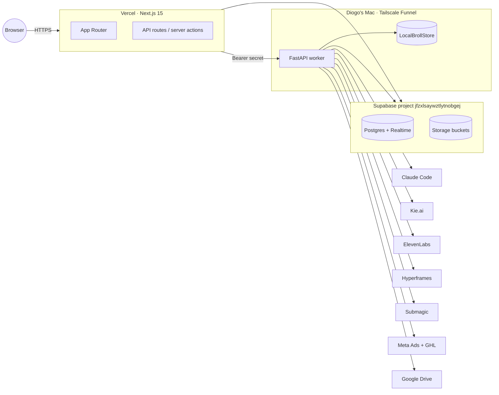

# VoxHorizon Marketing Control Panel

> **Status / current stack (2026-05-24).** The descriptions below this note
> are stale. The live system runs on a single Hostinger VPS: Next.js 15 +
> Supabase (Postgres / RLS / Realtime / Storage) + a Python FastAPI worker +
> a Hermes operator agent, fronted by Caddy. It is **not** the older
> Mac / Tailscale Funnel / Vercel / Claude-Code setup described further down.
> The pipeline is a 12-stage, server-gated DAG across image and video
> verticals. For the current architecture and the rebuild in progress, read
> [`PIPELINE-REBUILD-ARCHITECTURE.md`](./PIPELINE-REBUILD-ARCHITECTURE.md)
> and the decision records in [`docs/adr`](./docs/adr). The schema is defined
> by [`db/migrations`](./db/migrations) (see [`db/SCHEMA.md`](./db/SCHEMA.md)).

Single-operator control panel for VoxHorizon's AI marketing department. Replaces the Slack-driven workflow with a Next.js + Supabase UI, backed by a local Python worker reachable over Tailscale. v1 ships two parallel verticals end to end: an **image-ad pipeline** (brief → generate → review → launch → audit) and a **video voiceover + b-roll pipeline** (brief → script → voiceover → b-roll → compose → caption → review). Diogo is the only operator.

## Status

Active build — Phase 0 (foundation) in progress. Track progress via the [Master Tracker](../../issues/72).

| Milestone                         | Scope                                      | State       |
| --------------------------------- | ------------------------------------------ | ----------- |
| M0 — Foundation                   | Services, scaffolding, schema, docs        | In progress |
| M1 — Brief lifecycle              | Create / edit / approve briefs end to end  | Not started |
| M2 — Image generation loop        | Image creatives, iteration, chat-with-Ekko | Not started |
| M3 — Drive sync + launch package  | Drive mirroring, launch bundles            | Not started |
| M4 — Audit + cron + notifications | Meta + GHL pulls, verdicts, push + email   | Not started |
| M5 — Polish + launch              | Empty/error states, CI, production deploy  | Not started |

## Architecture (one paragraph)

Browser hits Next.js on Vercel (App Router, React 19, shadcn/ui, Tailwind). Server routes talk to **Supabase** (Postgres + Realtime + Storage) for state and to a **local FastAPI worker** for pipeline work. The worker runs on Diogo's Mac, exposed over **Tailscale Funnel**, authenticated with a per-request bearer secret. The worker shells out to **Claude Code** for agent loops, **Kie.ai** for image generation, **ElevenLabs** for voiceover, **Hyperframes** for video composition, **Submagic** for captions, **Meta Ads + GHL** for performance pulls, and **Google Drive** for shareable mirrors. The Vercel UI never talks to those services directly — Tailscale is the boundary, the worker is the integration layer, Postgres is the truth.

```
                                  Vercel (Next.js + Tailwind + shadcn)
                                  ┌────────────────────────────────────┐
   Diogo's browser ──HTTPS──────▶ │  App Router · server actions · UI  │
                                  └─────────────┬──────────────────────┘
                                                │
              ┌─────────────────────────────────┼────────────────────────────┐
              │ Supabase (US East)              │ Tailscale Funnel           │
              ▼                                 ▼                            │
   ┌──────────────────────┐         ┌──────────────────────┐                 │
   │ Postgres + Realtime  │         │  FastAPI worker      │                 │
   │ + Storage            │ ◀──────▶│  (Diogo's Mac)       │                 │
   │ project: jfzxlsa...  │         │  · routes/*          │                 │
   └──────────────────────┘         │  · services/*        │                 │
                                    │  · LocalBrollStore   │                 │
                                    └─────────┬────────────┘                 │
                                              │                              │
       ┌───────────┬───────────┬───────────┬──┴────────┬──────────┬──────────┤
       ▼           ▼           ▼           ▼           ▼          ▼          ▼
   Claude Code   Kie.ai   ElevenLabs   Hyperframes  Submagic   Meta+GHL   Drive
   (agent loop) (images)  (voiceover)  (video render)(captions) (perf)    (gog)
```

Mermaid version (for renderers that support it):



## Quick start

1. **Install deps.**

   ```bash
   pnpm install                    # Next.js side
   cd worker && uv sync --extra dev  # Python worker side
   ```

2. **Configure env.**

   ```bash
   cp .env.example .env.local
   cp worker/.env.example worker/.env
   ```

   Fill in values per [`SETUP.md`](./SETUP.md). Real credentials live in the team password vault, not the repo.

3. **Apply schema (idempotent — already applied to the live project).**

   ```bash
   supabase login
   supabase link --project-ref jfzxlsaywztlytnobgej
   supabase db push
   pnpm regen:types
   ```

4. **Run both halves.**

   ```bash
   pnpm dev                                       # Next.js on :3000
   cd worker && bash scripts/serve.sh             # FastAPI on :8000
   ```

See [`SETUP.md`](./SETUP.md) for the from-scratch recipe (Mac).

## Repository structure

```
.
├── app/                  Next.js App Router pages + API routes
│   ├── api/              Server routes (worker proxy, health)
│   ├── briefs/           Brief list + new + detail
│   ├── creatives/        Creative review surface
│   ├── launches/         Launch packages
│   ├── audit/            Performance + verdicts
│   ├── clients/          Client list + settings
│   └── settings/         Operator settings
├── components/           shadcn/ui + feature components (brief, chat, creative, funnel, kanban, notifications)
├── lib/                  Runtime helpers
│   ├── supabase/         server.ts, browser.ts, admin.ts, types.gen.ts
│   ├── worker.ts         Typed worker RPC client (Bearer auth, retries, timeouts)
│   ├── env.ts            cleanEnv() — trims trailing whitespace, throws on missing
│   └── utils.ts
├── hooks/                React hooks
├── styles/               Global Tailwind + theming
├── middleware.ts         Tailscale-only gate (defense in depth, off by default)
├── db/
│   ├── migrations/       Forward-only SQL migrations (Supabase CLI)
│   └── SCHEMA.md         Table-by-table reference
├── worker/               Local FastAPI worker (Python 3.11+, uv)
│   ├── src/
│   │   ├── main.py       FastAPI app factory, structlog, CORS
│   │   ├── auth.py       Bearer-secret middleware (constant-time compare)
│   │   ├── config.py     pydantic-settings model
│   │   ├── routes/       health, creative, audit, upload, chat, broll
│   │   └── services/     broll_store, claude_runner, scripts_runner, storage
│   ├── scripts/serve.sh
│   └── tests/
├── supabase/             Supabase CLI config
├── README.md             You are here
├── SETUP.md              From-zero bootstrap recipe
├── SECRETS.md            Secrets inventory + rotation
└── ARCHITECTURE.md       Locked spec
```

## Tech stack

| Layer                     | Choice                                                   | Version pin                      |
| ------------------------- | -------------------------------------------------------- | -------------------------------- |
| App framework             | Next.js (App Router)                                     | 15.x                             |
| UI runtime                | React                                                    | 19.x                             |
| Styling                   | Tailwind CSS                                             | 3.4.x                            |
| Component primitives      | shadcn/ui + Radix                                        | Latest                           |
| Type system               | TypeScript                                               | 5.6.x                            |
| Data + Realtime + Storage | Supabase (`@supabase/ssr`, `@supabase/supabase-js`)      | 2.x                              |
| Worker framework          | FastAPI + uvicorn                                        | 0.115+                           |
| Worker runtime            | Python                                                   | 3.11+                            |
| Worker deps               | uv + pydantic-settings + structlog + httpx + supabase-py | Latest                           |
| Image generation          | Kie.ai (GPT Image 2)                                     | External API                     |
| Voiceover                 | ElevenLabs                                               | External API                     |
| Video composition         | Hyperframes                                              | External API                     |
| Captions                  | Submagic                                                 | External API                     |
| Performance data          | Meta Ads + GoHighLevel                                   | External API                     |
| Asset mirroring           | Google Drive (`gog` CLI)                                 | External                         |
| Email                     | Resend                                                   | External                         |
| Web Push                  | VAPID via `web-push`                                     | npm                              |
| Hosting (UI)              | Vercel                                                   | Pro plan (Deployment Protection) |
| Network boundary          | Tailscale Funnel                                         | External                         |
| Agent                     | Claude Code (CLI + Agent SDK)                            | Latest                           |

## Where to look

- [`SETUP.md`](./SETUP.md) — bootstrap a fresh Mac end to end
- [`SECRETS.md`](./SECRETS.md) — every secret, location, rotation owner
- [`ARCHITECTURE.md`](./ARCHITECTURE.md) — locked spec, decisions, scope
- [`db/SCHEMA.md`](./db/SCHEMA.md) — Postgres table reference
- [Master Tracker (issue #72)](../../issues/72) — milestones + open issues
- [`worker/README.md`](./worker/README.md) — worker-specific runbook
- Upstream system (private): [`silva-1337/voxhorizon-marketing-dept`](https://github.com/silva-1337/voxhorizon-marketing-dept) — the Slack/Hermes-era marketing dept this control panel replaces

## Contributing

Single-author project (Diogo, via Pedro as collaborator). Workflow:

- Feature branches off `main`, one per milestone issue. Naming: `<type>/<slug>` (e.g. `docs/m0-18-trio`, `feat/m1-3-briefs-post`).
- PRs reference the issue they close (`Closes #N`).
- Conventional Commits (`feat:`, `fix:`, `docs:`, `chore:`, `refactor:`, `test:`).
- Husky pre-commit runs `eslint --fix` + `prettier --write` on staged files.
- CI gates: `pnpm tsc --noEmit`, `pnpm lint`, `cd worker && uv run pytest` (lands in M5).
- Commits authored by Pedro Veloso only. No AI / assistant attribution in commit trailers or PR bodies.

## License

Proprietary. All rights reserved by VoxHorizon. Not for redistribution.
